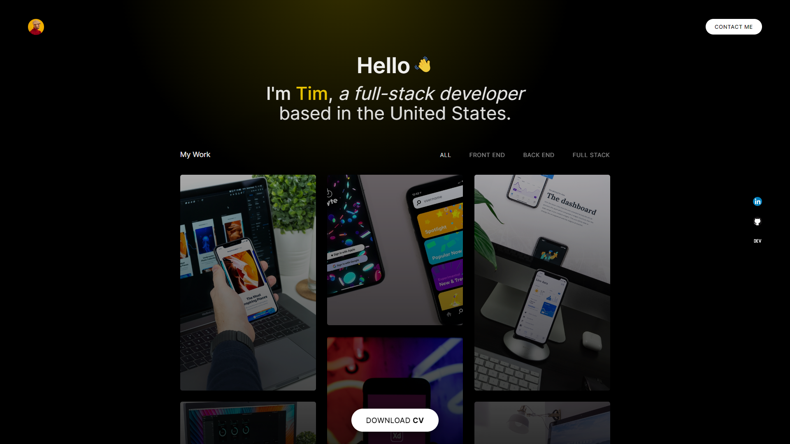

# Responsive Portfolio Website in HTML / CSS / JavaScript -- [Watch tutorial here](https://youtube.com/)

You can find all the copy-paste stuff in the 'resources.txt' file.

You can find the final code in the folder 'final-code'. You can use that if you get stuck.

## Premium Courses
[Professional CSS](https://bytegrad.com/courses/professional-css) &
[Professional JavaScript](https://bytegrad.com/courses/professional-javascript)